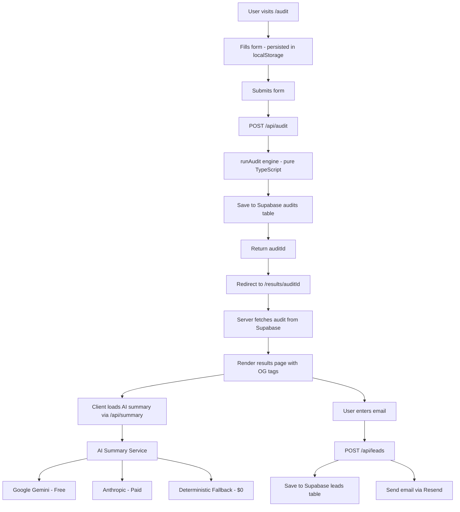

# ARCHITECTURE.md — SpendLens

## Tech Stack Decision
| Layer | Choice | Rationale |
|---|---|---|
| **Framework** | Next.js 14 (App Router) | Essential for Server-Side Rendering (SSR) of Open Graph (OG) tags for shareable URLs, and built-in API routes. |
| **Language** | TypeScript | Ensures type safety for complex audit engine logic and pricing data. |
| **Styling** | Tailwind CSS + shadcn/ui | Rapid development of a modern, accessible, and responsive UI. |
| **Database** | Supabase | Postgres-as-a-service with excellent TypeScript support and built-in RLS for secure data handling. |
| **Email** | Resend | Simple DX for transactional emails with a generous free tier. |
| **LLM** | Gemini / Anthropic | Multi-provider support. Uses Gemini 1.5 Flash (Free Tier) by default, with Anthropic and Deterministic fallbacks. |

## Data Flow Diagram

## Scalability & Performance
- **Deterministic Engine:** The core audit logic is a pure function, making it extremely fast and easy to test.
- **Edge Runtime:** The OG image generation runs on the edge for minimal latency.
- **SSR for SEO:** Results pages are server-rendered to ensure metadata is available for social sharing.
- **Rate Limiting:** IP-based rate limiting on lead capture prevents abuse of the Resend API.
