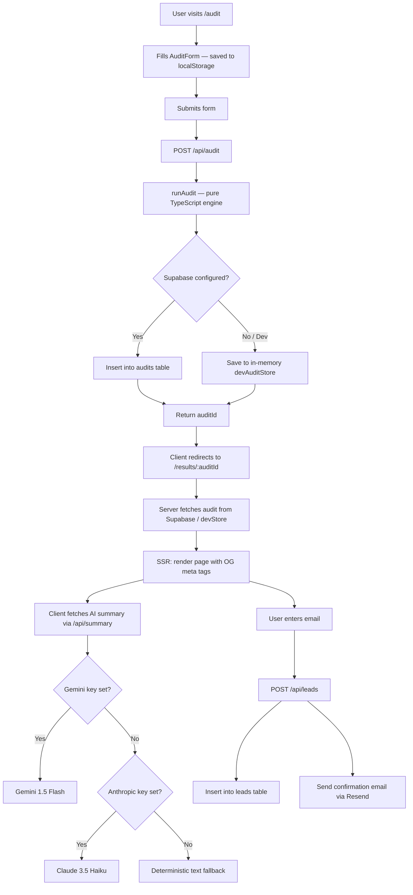

# 🧾 SpendLens — AI Spend Audit Tool

> **See exactly where your AI budget is burning.** SpendLens is a free, 2-minute audit tool for startup teams to identify redundant AI subscriptions, flag plan mismatches, and optimize total spend — no login, no bank connection required.


---

## Table of Contents

- [Live Demo](#live-demo)
- [Features](#features)
- [Tech Stack](#tech-stack)
- [Architecture Overview](#architecture-overview)
- [Data Flow](#data-flow)
- [Project Structure](#project-structure)
- [Audit Engine](#audit-engine)
- [AI Summary System](#ai-summary-system)
- [API Reference](#api-reference)
- [Database Schema](#database-schema)
- [Local Development](#local-development)
- [Environment Variables](#environment-variables)
- [Deployment](#deployment)
- [Testing](#testing)
- [CI/CD](#cicd)
- [Design Decisions & Trade-offs](#design-decisions--trade-offs)
- [Contributing](#contributing)

---

## Live Demo

**[spendlens.vercel.app](https://spendlens.vercel.app)**

---

## Features

- **Deterministic Audit Engine** — Rule-based TypeScript engine that identifies tool redundancy and plan mismatches with 100% accuracy and zero LLM hallucination risk.
- **Multi-Provider AI Summaries** — Personalized audit narratives powered by Google Gemini (free tier), with automatic fallback to Anthropic Claude and a deterministic text fallback at $0 cost.
- **Shareable Results** — Every audit generates a unique UUID-based URL with server-side rendered Open Graph tags for clean social sharing and SEO.
- **Privacy First** — No login required, no bank connections, no PII needed to run an audit.
- **Draft Persistence** — Audit form state is saved to `localStorage` so users can leave and return without losing work.
- **Lead Capture & Email** — Optional email entry sends a confirmation report link via Resend.
- **PDF Export** — Full client-side PDF export of audit results using jsPDF + html2canvas-pro.
- **Benchmark Comparison** — Spend-per-seat is compared against industry benchmarks segmented by team size.

---

## Tech Stack

| Layer | Technology | Rationale |
|---|---|---|
| **Framework** | Next.js 16 (App Router) | SSR for OG tags on shareable result URLs; built-in API routes eliminate a separate backend |
| **Language** | TypeScript 5 | Type safety across the audit engine's complex rule and pricing data structures |
| **Styling** | Tailwind CSS v4 + shadcn/ui | Rapid iteration; accessible component primitives; consistent design system |
| **Animations** | Framer Motion | Smooth transitions on results reveal |
| **Database** | Supabase (PostgreSQL) | Managed Postgres with Row Level Security; excellent TypeScript SDK; built-in Auth/Storage for future expansion |
| **Email** | Resend | Simple transactional email API; generous free tier; reliable delivery |
| **AI — Primary** | Google Gemini 1.5 Flash | Free tier makes each audit cost ~$0.000 for AI summaries |
| **AI — Fallback** | Anthropic Claude 3.5 Haiku | Paid fallback if Gemini is unavailable; ~$0.002 per summary |
| **Testing** | Vitest | Fast ESM-native test runner; seamless TypeScript integration |
| **PDF** | jsPDF + html2canvas-pro | Client-side PDF generation; html2canvas-pro required for Tailwind v4 oklch/oklab color support |

---

## Architecture Overview

```
┌─────────────────────────────────────────────────────────┐
│                     Next.js App Router                  │
│                                                         │
│  /            → Landing page (SSG)                      │
│  /audit       → Audit form (CSR + localStorage draft)   │
│  /results/[id]→ Results page (SSR + OG tags)            │
│                                                         │
│  API Routes:                                            │
│  POST /api/audit   → Run audit + save to Supabase       │
│  POST /api/leads   → Capture email + send via Resend    │
│  POST /api/summary → Re-generate AI summary on demand   │
│  GET  /api/og      → Edge-rendered OG image             │
└────────────────────┬────────────────────────────────────┘
                     │
        ┌────────────┼────────────┐
        │            │            │
   ┌────▼────┐  ┌────▼────┐  ┌───▼────┐
   │Supabase │  │ Gemini  │  │ Resend │
   │Postgres │  │Anthropic│  │ Email  │
   └─────────┘  └─────────┘  └────────┘
```

### Key Architectural Decisions

**Deterministic core, LLM periphery.** The audit math (savings calculations, rule evaluation, benchmark comparison) is 100% deterministic TypeScript. LLMs are only used for the prose summary — ensuring the numbers are always reliable while keeping the UX feel intelligent.

**Dev mode without infrastructure.** When `NEXT_PUBLIC_SUPABASE_URL` is not set in development, the app automatically uses an in-memory store (`globalThis.__spendlensDevAudits`). This means `npm run dev` works out of the box with zero external dependencies.

**Graceful degradation.** Every external integration (Supabase, Gemini, Anthropic, Resend) has a defined fallback path. The app never crashes — it degrades to a less-featured but functional state.

---

## Data Flow



---

## Project Structure

```
spendlens/
├── app/
│   ├── api/
│   │   ├── audit/route.ts        # POST: run audit, save to DB
│   │   ├── leads/route.ts        # POST: capture email lead
│   │   ├── og/route.tsx          # GET: edge OG image generation
│   │   └── summary/route.ts      # POST: generate/re-generate AI summary
│   ├── audit/page.tsx            # /audit — form page
│   ├── results/[auditId]/page.tsx# /results/:id — SSR results page
│   ├── layout.tsx
│   ├── page.tsx                  # / — landing page
│   └── globals.css
│
├── components/
│   ├── AuditForm/
│   │   ├── AuditForm.tsx         # Main form with localStorage persistence
│   │   └── ToolRow.tsx           # Per-tool row (tool selector, plan, seats, spend)
│   ├── Results/
│   │   ├── AISummary.tsx         # Streams/displays AI summary
│   │   ├── BenchmarkCard.tsx     # Spend-per-seat vs industry benchmark
│   │   ├── CredexCTA.tsx         # Conversion CTA component
│   │   ├── EmailReportButton.tsx # Lead capture modal trigger
│   │   ├── ExportPDFButton.tsx   # Client-side PDF export
│   │   ├── HeroSavings.tsx       # Total savings hero stat
│   │   ├── ShareButton.tsx       # Copy shareable URL
│   │   └── ToolBreakdown.tsx     # Per-tool recommendation table
│   └── ui/                       # shadcn/ui primitives (button, card, dialog, etc.)
│
├── lib/
│   ├── audit-engine/
│   │   ├── index.ts              # runAudit() — orchestrator
│   │   ├── rules.ts              # auditTool() — rule evaluation logic
│   │   ├── pricing.ts            # PRICING_DATA — all tool/plan prices
│   │   └── types.ts              # TypeScript interfaces
│   ├── ai-summary.ts             # generateAuditSummary() — Gemini → Anthropic → fallback
│   ├── dev-audit-store.ts        # In-memory store for development without Supabase
│   ├── export-pdf.ts             # Client-side PDF generation logic
│   ├── fetch-json.ts             # Typed fetch wrapper with error handling
│   ├── resend.ts                 # sendConfirmationEmail()
│   ├── supabase.ts               # Supabase client factory (public + admin)
│   └── supabase/
│       └── schema.sql            # Database schema and RLS policies
│
├── __tests__/
│   ├── audit-engine.test.ts      # Core rule and math tests
│   └── export-pdf.test.ts        # PDF export tests
│
├── .github/workflows/ci.yml      # GitHub Actions: lint + test on push
├── next.config.ts                # html2canvas-pro alias for Tailwind v4
├── vitest.config.ts
└── package.json
```

---

## Audit Engine

The audit engine (`lib/audit-engine/`) is a pure TypeScript module — no side effects, no external calls, fully testable.

### Entry Point

```typescript
import { runAudit } from '@/lib/audit-engine';

const result = runAudit({
  tools: [
    { toolId: 'cursor',         plan: 'pro',      seats: 5, monthlySpend: 100 },
    { toolId: 'github_copilot', plan: 'business', seats: 5, monthlySpend: 95  },
  ],
  teamSize: 5,
  primaryUseCase: 'coding',
});
// result.totalAnnualSavings → 1140 (GitHub Copilot flagged as redundant)
```

### Rule Categories

The engine evaluates each tool through three ordered rule categories, returning the recommendation with the highest savings:

**1. Redundancy Rules (highest priority — up to 100% savings)**

| Condition | Action | Reason |
|---|---|---|
| `github_copilot` + `cursor` (pro/business) | Eliminate Copilot | Cursor Pro/Business includes full LLM coding assistance |
| `windsurf` or `v0` + `cursor` | Eliminate Windsurf/v0 | Competing tools; consolidate into Cursor |
| `claude` + `cursor` | Optimize Claude | Cursor already includes Claude 3.5 Sonnet access |
| `gemini` + (`chatgpt` or `claude`) + non-research use case | Optimize Gemini | Multiple general-purpose chat UIs; consolidate |
| `chatgpt` + `claude` + `writing` use case | Switch to Claude | Claude is superior for writing; eliminate ChatGPT |
| `perplexity` Pro + any major LLM | Optimize Perplexity | Modern LLMs have built-in web search |

**2. Plan Optimization Rules (medium priority)**

| Condition | Action |
|---|---|
| Actual spend > expected cost for detected plan by >$5 | Flag overpayment |
| `claude` Pro + 5+ seats | Suggest Team plan ($25/user vs $20/user with admin controls) |
| Team/Business plan + <3 seats | Downgrade to individual plans |
| 50+ seats on Pro/Business plan | Suggest Enterprise negotiation |

**3. Default**

If no rule fires, the tool is marked `keep` with 0 savings.

### Supported Tools

| Tool ID | Tool Name | Plans Available |
|---|---|---|
| `cursor` | Cursor | hobby, pro, business, enterprise |
| `github_copilot` | GitHub Copilot | individual, business, enterprise |
| `claude` | Claude | free, pro, max, team, enterprise, api direct |
| `chatgpt` | ChatGPT | free, plus, team, enterprise, api direct |
| `gemini` | Gemini | business, enterprise, education, api direct |
| `gemini_api` | Gemini API | direct (custom pricing) |
| `anthropic_api` | Anthropic API | direct (custom pricing) |
| `openai_api` | OpenAI API | direct (custom pricing) |
| `perplexity` | Perplexity | free, pro, enterprise |
| `windsurf` | Windsurf | free, pro, teams |
| `v0` | v0 (Vercel) | free, premium, enterprise |

### Benchmark Logic

Spend-per-seat benchmarks are segmented by team size:

| Team Size | Industry Benchmark ($/seat/mo) |
|---|---|
| < 10 | $45 |
| 10 – 49 | $35 |
| 50+ | $25 |

---

## AI Summary System

`lib/ai-summary.ts` implements a three-tier provider chain:

```
1. Google Gemini 1.5 Flash  →  free tier, primary
2. Anthropic Claude 3.5 Haiku  →  paid fallback (~$0.002/summary)
3. Deterministic text  →  always available, $0 cost
```

The summary prompt instructs the model to produce a 100-word, second-person, finance-literate paragraph citing specific tool names, actual dollar figures, and total annual savings potential. No bullet points, no headers, no filler.

The summary is generated twice: once eagerly during `POST /api/audit` (stored in the DB record), and can be re-fetched on demand via `POST /api/summary` if the stored value is stale or missing.

---

## API Reference

### `POST /api/audit`

Runs the deterministic audit engine, generates an AI summary, and persists the result.

**Request body:**
```json
{
  "tools": [
    { "toolId": "cursor", "plan": "pro", "seats": 3, "monthlySpend": 60 },
    { "toolId": "github_copilot", "plan": "business", "seats": 3, "monthlySpend": 57 }
  ],
  "teamSize": 3,
  "primaryUseCase": "coding"
}
```

**Response:**
```json
{
  "auditId": "550e8400-e29b-41d4-a716-446655440000",
  "result": {
    "auditId": "550e8400-...",
    "toolAudits": [...],
    "totalCurrentSpend": 117,
    "totalMonthlySavings": 57,
    "totalAnnualSavings": 684,
    "isAlreadyOptimal": false,
    "spendPerDeveloper": 39,
    "benchmarkAverage": 45,
    "aiSummary": "Your 3-person team is paying..."
  }
}
```

**Error responses:**
- `400` — Missing or invalid `tools` array
- `503` — Supabase not configured (production only; dev uses in-memory store)
- `500` — Database insert error (check Supabase schema setup)

---

### `POST /api/leads`

Captures an email lead, saves to the `leads` table, and sends a confirmation email via Resend.

**Request body:**
```json
{
  "email": "user@startup.com",
  "auditId": "550e8400-...",
  "companyName": "Acme Inc",
  "role": "CTO",
  "teamSize": 10,
  "referralCode": "LAUNCH"
}
```

**Notes:**
- Includes a honeypot field: if `website` is present in the body, the request returns `200` silently (bot detection).
- Email sending is skipped gracefully if `RESEND_API_KEY` is not set.

---

### `POST /api/summary`

Re-generates an AI summary for an existing audit result. Used client-side to populate the summary section after initial page load.

**Request body:**
```json
{
  "auditResult": { ... },
  "teamSize": 5,
  "primaryUseCase": "coding"
}
```

---

### `GET /api/og`

Generates a dynamic Open Graph image for a given audit result. Runs on the **Edge Runtime** for minimal latency. Used by Next.js metadata in `/results/[auditId]/page.tsx`.

---

## Database Schema

Run this SQL in your Supabase project's SQL Editor before first deployment:

```sql
-- Audits table (publicly readable for shareable URLs)
CREATE TABLE audits (
  id                   UUID PRIMARY KEY DEFAULT gen_random_uuid(),
  tools_input          JSONB NOT NULL,
  audit_result         JSONB NOT NULL,
  total_monthly_savings DECIMAL(10, 2) NOT NULL,
  total_annual_savings  DECIMAL(10, 2) NOT NULL,
  team_size            INT,
  primary_use_case     TEXT,
  created_at           TIMESTAMPTZ DEFAULT NOW()
);

-- Leads table (server-only; never exposed to clients)
CREATE TABLE leads (
  id            UUID PRIMARY KEY DEFAULT gen_random_uuid(),
  audit_id      UUID REFERENCES audits(id),
  email         TEXT NOT NULL,
  company_name  TEXT,
  role          TEXT,
  team_size     INT,
  referral_code TEXT,
  is_high_savings BOOLEAN DEFAULT FALSE,
  created_at    TIMESTAMPTZ DEFAULT NOW()
);

-- Row Level Security
ALTER TABLE audits ENABLE ROW LEVEL SECURITY;
ALTER TABLE leads  ENABLE ROW LEVEL SECURITY;

-- Audits: anyone can read (needed for shareable URLs)
CREATE POLICY "Audits are publicly readable"
  ON audits FOR SELECT USING (true);

-- Audits: only server (service role) can insert
CREATE POLICY "Service role can insert audits"
  ON audits FOR INSERT WITH CHECK (true);

-- Leads: no client access ever
CREATE POLICY "Service role only for leads"
  ON leads USING (false);
```

**Key design notes:**
- `audits` rows are intentionally world-readable — the audit UUID is the access control mechanism (unguessable 128-bit random ID).
- `leads` rows are never accessible from the client. Only the `SUPABASE_SERVICE_ROLE_KEY` (server-side only, never prefixed `NEXT_PUBLIC_`) can read or write them.
- `audit_result` and `tools_input` are stored as JSONB, allowing the full TypeScript result object to be round-tripped without a rigid column schema.

---

## Local Development

### Prerequisites

- Node.js 20+
- npm 10+

### Setup

```bash
# 1. Clone the repository
git clone https://github.com/your-username/spendlens.git
cd spendlens

# 2. Install dependencies
npm install

# 3. Create your local environment file
cp .env.example .env.local
# Edit .env.local and fill in your keys (see Environment Variables section)

# 4. Start the development server
npm run dev
# → http://localhost:3000
```

### Dev Mode Without Supabase

If `NEXT_PUBLIC_SUPABASE_URL` is not set, the app automatically switches to an in-memory store (`devAuditStore`). Audit results are stored in `globalThis` for the duration of the Node.js process. This lets you develop and test the full audit flow with zero infrastructure setup.

> **Note:** The in-memory store does not survive server restarts. Navigating directly to a `/results/:id` URL after a restart will return a 404 in dev mode.

---

## Environment Variables

Create a `.env.local` file in the project root with the following variables:

```env
# ─── Supabase (Required for production) ─────────────────────────────────────
NEXT_PUBLIC_SUPABASE_URL=https://xxxxxxxxxxxxxxxxxxxx.supabase.co
NEXT_PUBLIC_SUPABASE_ANON_KEY=eyJhbGciOiJIUzI1NiIsInR5cCI6IkpXVCJ9...
SUPABASE_SERVICE_ROLE_KEY=eyJhbGciOiJIUzI1NiIsInR5cCI6IkpXVCJ9...

# ─── AI Providers ────────────────────────────────────────────────────────────
# Primary (free tier — strongly recommended)
GOOGLE_GEMINI_API_KEY=AIzaSy...

# Fallback (paid — optional, used only if Gemini fails)
ANTHROPIC_API_KEY=sk-ant-api03-...

# ─── Email (Optional) ────────────────────────────────────────────────────────
RESEND_API_KEY=re_...
```

### Variable Reference

| Variable | Required | Where to get it | Notes |
|---|---|---|---|
| `NEXT_PUBLIC_SUPABASE_URL` | Production | Supabase → Project Settings → API | Public; safe to expose |
| `NEXT_PUBLIC_SUPABASE_ANON_KEY` | Production | Supabase → Project Settings → API | Public anon key; RLS enforced |
| `SUPABASE_SERVICE_ROLE_KEY` | Production | Supabase → Project Settings → API | **Never expose client-side.** Server-only. Bypasses RLS |
| `GOOGLE_GEMINI_API_KEY` | Recommended | [aistudio.google.com](https://aistudio.google.com) | Free tier; primary AI provider |
| `ANTHROPIC_API_KEY` | Optional | [console.anthropic.com](https://console.anthropic.com) | Paid; used if Gemini unavailable |
| `RESEND_API_KEY` | Optional | [resend.com](https://resend.com) → API Keys | Email confirmation feature |

---

## Deployment

### Vercel (Recommended)

SpendLens is built for Vercel. The OG image API route is configured for Edge Runtime, and Next.js app routing is auto-detected.

```bash
# 1. Push your code to GitHub
git init
git add .
git commit -m "feat: initial commit"
gh repo create spendlens --public --source=. --push

# 2. Import on Vercel
# Go to vercel.com → New Project → Import from GitHub
# Vercel auto-detects Next.js — no build config needed
```

In Vercel's **Project → Settings → Environment Variables**, add all variables from the table above. Then click **Deploy**.

**Important:** Set environment variables for all three environments (Production, Preview, Development) as needed.

### Self-Hosted (VPS / Docker)

```bash
# Build
npm ci
npm run build

# Run (set env vars in your shell or process manager)
npm start
# Runs on port 3000 by default
```

Point a reverse proxy (Nginx, Caddy) to `localhost:3000`. Example Nginx config:

```nginx
server {
    listen 80;
    server_name yourdomain.com;

    location / {
        proxy_pass http://localhost:3000;
        proxy_http_version 1.1;
        proxy_set_header Upgrade $http_upgrade;
        proxy_set_header Connection 'upgrade';
        proxy_set_header Host $host;
        proxy_cache_bypass $http_upgrade;
    }
}
```

For process management, use PM2:

```bash
npm install -g pm2
pm2 start npm --name spendlens -- start
pm2 save
pm2 startup
```

### Pre-Deployment Checklist

- [ ] Supabase project created and schema SQL executed
- [ ] Row Level Security enabled on both tables
- [ ] `SUPABASE_SERVICE_ROLE_KEY` set as a server-only env var (no `NEXT_PUBLIC_` prefix)
- [ ] `NEXT_PUBLIC_SUPABASE_URL` and `NEXT_PUBLIC_SUPABASE_ANON_KEY` set
- [ ] At least one AI key set (`GOOGLE_GEMINI_API_KEY` recommended)
- [ ] `RESEND_API_KEY` set if email confirmation is needed
- [ ] Custom domain configured if applicable (update email `from` address in `lib/resend.ts`)

---

## Testing

Tests are written with [Vitest](https://vitest.dev) and cover the core audit engine logic.

```bash
# Run all tests once
npm run test
# or
npx vitest run

# Watch mode (re-runs on file save)
npx vitest
```

### Test Coverage

**`__tests__/audit-engine.test.ts`**

| Test | What it verifies |
|---|---|
| Redundancy — Copilot + Cursor | `github_copilot` is flagged `eliminate` when `cursor` Pro is present |
| Downgrade — small team on Team plan | Team plan is flagged for `downgrade` when seats < 3 |
| Switch — ChatGPT + Claude + writing | `chatgpt` is flagged `switch` to `claude` for writing use cases |
| Optimal stack | `isAlreadyOptimal` is `true` when total savings < $10 |
| Math accuracy | `totalAnnualSavings === totalMonthlySavings * 12` |

**`__tests__/export-pdf.test.ts`**

Covers the PDF export utility functions.

---

## CI/CD

GitHub Actions runs on every push and pull request to `main`:

```yaml
# .github/workflows/ci.yml
jobs:
  lint-and-test:
    steps:
      - npm ci
      - npm run lint      # ESLint
      - npx vitest run    # Unit tests
```

Tests inject fake Supabase environment variables so the test suite runs without real infrastructure. No secrets are required in CI for tests to pass.

---

## Design Decisions & Trade-offs

**Manual input vs. Plaid/bank sync**
Chose manual input to eliminate privacy friction for a free tool. Bank OAuth adds significant development and trust overhead for a 2-minute audit.

**Deterministic rules vs. LLM-only**
The audit math is pure TypeScript — savings figures are always exact. LLMs are used exclusively for prose generation, where minor inaccuracies are tolerable and value is high.

**Supabase vs. PlanetScale**
Chose Supabase for its built-in Auth and Storage potential, superior TypeScript DX, and free tier that covers early-stage traffic. RLS policies let us expose audit rows publicly without a separate auth layer.

**localStorage vs. server-side drafts**
Draft persistence in `localStorage` avoids DB writes for incomplete audits and removes the need for user accounts entirely — consistent with the "no login" philosophy.

**html2canvas-pro vs. html2canvas**
Tailwind CSS v4 uses `oklab`/`oklch` color functions that the original html2canvas cannot parse. `html2canvas-pro` is a maintained fork that handles these color spaces. Both Turbopack and Webpack are aliased in `next.config.ts`.

**Multi-provider AI fallback**
The Gemini free tier covers the vast majority of traffic at $0. If it's unavailable, Anthropic provides a reliable paid fallback. The deterministic fallback ensures the feature never fails completely, even if both APIs are down.

---

## Contributing

1. Fork the repository
2. Create a feature branch: `git checkout -b feat/your-feature`
3. Make your changes, including tests for new audit rules
4. Ensure tests pass: `npx vitest run`
5. Ensure lint passes: `npm run lint`
6. Open a pull request against `main`

When adding new tools or plans, update both `lib/audit-engine/pricing.ts` (price data) and `lib/audit-engine/rules.ts` (redundancy/optimization rules), then add corresponding test cases in `__tests__/audit-engine.test.ts`.

---

*Built by the SpendLens Team. All pricing data sourced directly from vendor pages. See [PRICING_DATA.md](PRICING_DATA.md) for sources and last-updated dates.*
